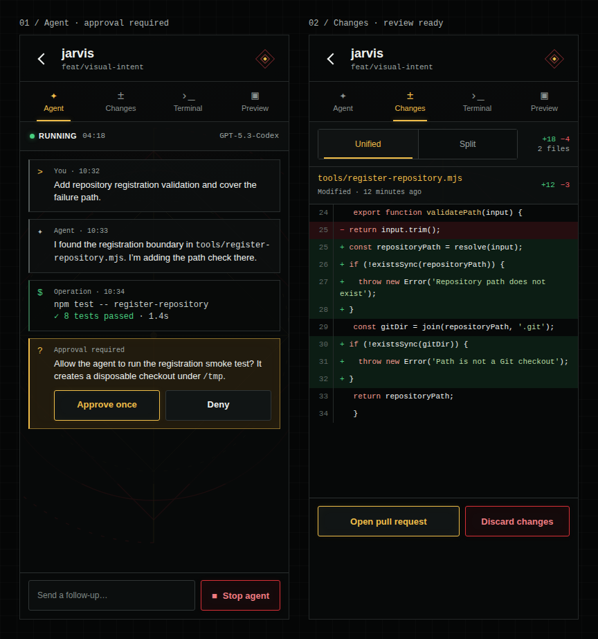

# Jarvis Visual Intent

## Direction

Jarvis should feel like a serious operational console touched by technomancy: quiet graphite machinery, hot-rod red structure, warm gold energy, and large spell geometry etched behind the interface.

The reference direction combines:

- Circuit Grimoire's restrained graphite, red, and gold palette;
- Crimson Invocation's large background sigils;
- dense, real operational content with minimal ornamental copy;
- crisp, compact controls designed for repeated use on a phone.

This is not fantasy ornament laid over a dashboard. The magical and technical languages should appear to be the same system.

## Governing Principles

1. **Content leads.** Repository state, agent activity, code, and terminal output establish hierarchy. Do not add labels such as "SYSTEMS," fake model numbers, lore, or decorative telemetry.
2. **Gold is emitted light, not paint.** Gold draws a fine edge or glows through a surface. It should not become a large filled button or panel.
3. **Sigils are architecture.** Large ritual geometry sits behind content at low contrast. It must never become a badge, watermark, or legibility hazard.
4. **Red gives structure and consequence.** Use restrained crimson for active structure, dangerous actions, errors, and selected emphasis. Preserve brighter semantic red for failures and Stop.
5. **Dark surfaces remain neutral.** Avoid blue/slate dark mode. Surfaces should read as black graphite, charcoal, and smoked glass.
6. **Density remains humane.** Jarvis is information-dense, but touch targets, body text, line height, and open space must remain comfortable on a 390 CSS-pixel phone.

## Palette Roles

| Role | Intent | Reference |
| --- | --- | --- |
| Canvas | Near-black graphite | `#070909` |
| Raised surface | Neutral charcoal | `#0d1010` to `#111515` |
| Hairline | Cool neutral gray | `#303535` |
| Primary text | Soft white | `#eef1ef` |
| Secondary text | Readable neutral gray | `#929a98` or lighter |
| Energy / selection | Warm metallic gold | `#efbd49` |
| Structure / danger | Hot-rod crimson | `#d52f36` |
| Healthy / connected | Signal green | `#48cf80` |

Gold, red, and green must not replace text or icons as the only indication of state.

## Gold Restraint

### Use gold for

- chart traces, metric values, and selected telemetry;
- one-pixel borders, short underlines, focus rings, and restrained glows;
- selected navigation text or icons;
- terminal prompts and small machine-data highlights;
- tiny status chips or indicator marks when paired with text;
- the small center of the Jarvis sigil mark.

### Do not use gold for

- fully filled buttons;
- fully filled segmented-control selections;
- broad card backgrounds;
- large navigation backgrounds;
- long blocks of text;
- several adjacent controls competing for attention.

Primary affirmative actions should use a graphite surface with gold text and a gold hairline. A hover, focus, or pressed state may add a faint translucent gold wash, never a solid yellow fill.

## Crimson Restraint

Red follows the same material rule as gold: it should read as illuminated structure, not paint. Destructive actions use a graphite surface, crimson text and icon, a crimson hairline, and at most a faint translucent red wash. Keep the action explicit with words such as "Stop," "Discard," or "Delete" rather than relying on color.

Solid crimson is reserved for tiny critical indicators or exceptional alarm states, not ordinary button bodies, tabs, cards, or navigation. A destructive button may become slightly brighter on hover, focus, or press without turning into a solid red slab.

## Sigil System

Use one or two large geometric constructions per phone viewport. Build them from circles, diamonds, axes, orbital marks, and sparse dashed arcs. Their linework should mix deep crimson and dim gold.

- Keep normal opacity around 6% to 11%.
- Crop geometry at viewport edges so it feels environmental rather than logo-like.
- Let it show primarily through open space and lightly translucent panels.
- Reduce or mask it behind terminal output, diffs, form fields, and long prose.
- Keep placement stable across related screens so navigation feels spatially continuous.
- Do not animate continuously. If motion is introduced, it must be slow, optional, and disabled by reduced-motion settings.

The sigil must disappear before the content does. If a line resembles a divider, crosses a text baseline, or weakens code contrast, fade or mask it locally.

## Surfaces and Hierarchy

- Use square or slightly eased corners; avoid pill-heavy or soft card styling.
- Prefer one-pixel borders over shadows. Reserve glow for active gold/red indicators.
- Do not put cards inside cards. Timeline rows, repository rows, and metric tiles are the framed units.
- Use translucent charcoal only when it reveals the sigil subtly. Functional canvases may be more opaque.
- Leave real open space instead of filling gaps with explanatory copy or decorative labels.

## Type

- Use a compact humanist sans for names, prose, controls, and task activity.
- Use a monospace face for values, branches, timestamps, terminal output, code, and concise metadata.
- Body and operational text should generally be at least 12 CSS pixels on a 390-pixel viewport.
- Secondary metadata should generally be at least 10 CSS pixels with sufficient contrast.
- Do not use monospace everywhere; it flattens hierarchy and turns the product into a costume terminal.
- Letter spacing is `0` except for very short uppercase status labels.

## Controls

- Phone touch targets should be at least 44 by 44 CSS pixels where practical.
- Icon-only controls need familiar symbols, accessible names, and visible focus treatment.
- Selected tabs use gold text/icon plus a short gold underline or edge, not a filled gold tab.
- Affirmative buttons use graphite, a gold hairline, and gold or white text.
- Secondary buttons use a neutral border and white/gray text.
- Stop, delete, and destructive confirmation use graphite surfaces with crimson text, icons, and hairlines.
- Approval and denial must remain visually distinct without making approval a bright yellow slab.
- Terminal modifier keys may have a gold outline; their keycaps remain dark.

## Screen Application

### Home

- Jarvis identity, worker connectivity, host metrics, and repositories are enough. Avoid a generic page title when the content is self-explanatory.
- Gold belongs primarily to metric values, active traces, and selected navigation.
- Show the active task; omit repetitive "ready" filler from idle repositories.
- Let a large sigil occupy the open lower field without forcing the repository list to fill the viewport.

### Agent

- Keep user, assistant, operation, and question rows visually distinct through icons, borders, and restrained tints.
- Questions may receive a dim gold border and smoked-gold surface.
- Approval controls remain dark with gold edges.
- The Stop action remains persistently visible with an explicit label, stop icon, and restrained crimson edge treatment.

### Terminal

- Terminal content is a protected semantic canvas. Favor maximum text contrast over background spectacle.
- Allow only a trace of sigil geometry through the terminal surface.
- Keep prompt gold, path green, failures red, and ordinary output neutral.
- Mobile utility keys remain dark; selected or important keys receive gold outlines only.

### Changes

- Preserve conventional red deletion and green addition semantics.
- Use gold for file identity, selected diff mode edges, and pull-request emphasis.
- Selected segmented controls remain dark with a gold border or underline.
- Long code must wrap deliberately or scroll horizontally; it must not be silently clipped.

## Anti-Patterns

- Solid yellow or gold buttons and tabs
- Solid red buttons or large red panels
- Sigils competing with card borders or code
- Fake technical labels, lore, or decorative status copy
- Tiny low-contrast metadata
- Identical placeholder rectangles used as navigation icons
- Gold used simultaneously for selection, success, warning, and every action
- Dense surfaces added solely to avoid empty space

## Review Checklist

Review every core pane at 390 by 844 CSS pixels and at a wider desktop viewport.

- Real content is the first thing noticed.
- No affirmative control is filled solid gold.
- Selected navigation is obvious without a filled background.
- Sigils are visible but never cross readable text at distracting contrast.
- Body text, metadata, code, and terminal output are legible at normal phone scale.
- Touch targets are comfortable and stable.
- Terminal and diff semantic colors remain conventional.
- No text or control overflows its container.
- Reduced-motion mode preserves the complete experience.
- The screen still works if the sigil layer is removed.

## Existing References

- [Selected hybrid screen set](dither-kit-feasibility/hybrid-screens-overview.png)
- [Editable hybrid prototype](dither-kit-feasibility/hybrid-screens.html)
- [Dither Kit feasibility study](dither-kit-feasibility/README.md)

The existing hybrid is a directional reference, not a pixel-perfect specification. In particular, its solid gold approval and selected-segment fills are superseded by this document.

## Independent Interpretation Test

A fresh implementation subagent received this document as its sole visual authority and produced two phone-scale samples without copying the earlier prototype CSS:

- [Agent approval screen](intent-validation/agent-screen.png)
- [Changes review screen](intent-validation/changes-screen.png)
- [Editable validation source](intent-validation/intent-validation.html)

The interpretation preserved the graphite shell, large red/gold sigil, restrained gold selection, dark outlined affirmative controls, outlined crimson destructive actions, conventional diff colors, and operational density. Both screens render at 390 by 844 CSS pixels without content overflow, and neither uses a solid-gold or solid-red control. The oversized environmental sigil is deliberately clipped by the phone frame.

The test left the exact humanist font and precise sigil geometry/masking strength open. These are intentional implementation choices provided they satisfy the principles and review checklist above.