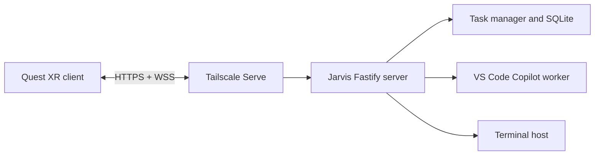

# Jarvis XR Technical Design

## Status

First-pass technical design for a native Meta Quest spatial client. This is a feasibility-oriented direction, not a commitment to publish on the Meta Horizon Store.

## Goal

Make Jarvis's repositories, tasks, and review state spatially manipulable. A user should be able to arrange repository workspaces, bring a task into focus, compare changes side-by-side, and use controller, hand, voice, or keyboard input without turning the headset into a conventional flat-screen IDE.

The desktop remains the execution and trust boundary. The Quest app is a spatial, authenticated client; it never hosts a repository, terminal, VS Code session, or Copilot credential.

## Non-goals for the First Slice

- Replacing VS Code or a desktop terminal.
- Arbitrary shell input from XR.
- Dependence on passthrough, persistent room anchors, or speech recognition for basic operation.
- Embedding a VPN client in Jarvis's Quest app.
- Store distribution before sideloaded development use is reliable.

## Architecture



The server must remain bound to `127.0.0.1`. Tailscale Serve provides the private HTTPS endpoint; a sideloaded Quest Tailscale client is acceptable for development. A travel router that joins the Tailnet is the preferred fallback if Horizon OS VPN behavior proves unreliable.

Transport privacy is necessary but insufficient. The XR app must pair with Jarvis and receive a short-lived, revocable capability token. Initial scopes are `repositories:read`, `tasks:read`, `tasks:write`, and `approvals:write`. Terminal capabilities are deliberately absent.

## Technology Choices

| Concern | Choice | Reason |
| --- | --- | --- |
| Quest application | Unity LTS, C# | Fast iteration for standalone Android XR, mature device tooling, and strong automated test support. |
| XR runtime | OpenXR plus Meta XR SDK | OpenXR keeps application input and rendering portable; Meta extensions provide Quest hand tracking, passthrough, and spatial anchors behind explicit adapters. |
| Interaction | Unity XR Interaction Toolkit with an app-owned interaction layer | Provides controller and hand primitives while preventing vendor interaction objects from becoming application state. |
| Rendering | Unity UI Toolkit for text-heavy panels, world-space canvases only at the presentation edge | Suits repository/task data and keeps layout logic testable outside rendering components. |
| Server | Existing Fastify/TypeScript server | Jarvis already owns task execution, event fan-out, Git, and persistence. |
| Protocol | Versioned JSON REST and WebSocket contract under `/api/xr/v1` and `/ws/xr/v1` | Avoids coupling Unity to PWA response shapes and permits protocol-contract tests. |
| Shared schema | JSON Schema source committed with server code; generated C# DTOs and TypeScript validators | Gives both clients compile-time types and wire-level compatibility tests. |
| Networking | `UnityWebRequest` for REST and a maintained managed WebSocket package behind `IXrTransport` | Allows deterministic in-process fakes and reconnect testing. |
| Unit testing | Unity Test Framework, NUnit | Supports fast Edit Mode tests without an emulator or headset. |
| Device testing | Unity Play Mode tests on Quest through ADB; a dedicated physical-device smoke script | Verifies headset-specific rendering, input, lifecycle, and network behavior. |
| End-to-end testing | Fastify fixture server plus a Unity fake transport and recorded event streams | Tests normal and failure paths without Copilot, a Tailnet, or a headset. |

The client should live in a separate `apps/xr` Unity project. Do not put Unity-generated files, `Library/`, APKs, or Android build output under version control.

## XR Client Modules

```text
apps/xr/Assets/Jarvis/
  Domain/          Pure records, reducers, policies, and commands
  Protocol/        Generated DTOs, schema versioning, serialization
  Transport/       REST/WebSocket implementation and reconnection policy
  Application/     Use cases: load workspace, submit task, approve, arrange
  Presentation/    Unity views, panel binding, layout animation
  Interaction/     Controller, hand, voice, and keyboard adapters
  Platform/        Meta/OpenXR adapters, persistence, lifecycle
  Tests/           Edit Mode, Play Mode, fixture, and device smoke tests
```

Dependency direction is inward. `Domain` imports no Unity or Meta namespace. `Application` depends on interfaces such as `IXrTransport`, `ILayoutStore`, `ISpeechInput`, `IHandInput`, and `IClock`; only outer modules reference Unity, OpenXR, or Meta SDKs.

## Spatial Model

The persistent model is intent, not coordinates owned by a scene object:

```text
SpatialWorkspace
  repositoryId
  panels: PanelPlacement[]

PanelPlacement
  panelId
  kind: repository | task | diff | preview
  localPosition, localRotation, localScale
  focusState
```

For the first release, placements are stored locally per headset and workspace. They are resettable and treated as advisory. World anchors and shared layouts are a later capability because their platform lifecycle and conflict semantics would otherwise dominate the work.

`WorkspaceReducer` maps repository/task events and user commands to immutable spatial state. A `SpatialLayoutPolicy` turns that state into target placements. Unity view components only animate and render those targets. This allows layout behavior to be tested as regular C# data transformations.

## Interaction Model

Controller input is the baseline. It must fully support selecting, grabbing, placing, scrolling, focusing, and confirming actions.

Hand input is an optional adapter that emits the same semantic actions as controllers: `Select`, `BeginGrab`, `MoveGrab`, `EndGrab`, `Scroll`, and `Confirm`. Gesture recognizers must never mutate panel transforms directly.

Voice is a draft-input adapter, not an authority path:

1. Speech produces a visible editable transcript.
2. The user explicitly sends the transcript to start or follow up a task.
3. Stop and approval actions require a separate confirmation gesture or controller action.

The first voice spike may use Android/Meta speech facilities if they are available on the target OS. The application depends only on `ISpeechInput`; a keyboard transcript entry path remains required. Do not choose a cloud speech vendor until offline behavior, privacy, latency, and Quest support are evaluated on device.

## Jarvis XR Contract

Do not expose the existing PWA API as an accidental long-term Unity API. Add narrow XR endpoints only after the Quest client has a demonstrated read-only prototype:

- `GET /api/xr/v1/workspace`: repositories, active tasks, current summaries, and a protocol version.
- `POST /api/xr/v1/pairings`: consumes a user-confirmed one-time pairing code and returns a scoped device token.
- `POST /api/xr/v1/tasks`: starts a task with an explicit repository and prompt.
- `POST /api/xr/v1/tasks/:id/messages`: sends a follow-up or answer.
- `POST /api/xr/v1/tasks/:id/approvals`: records a confirmed decision.
- `GET /ws/xr/v1`: streams ordered workspace and task events with resumable cursors.

The initial XR contract intentionally omits terminal sessions, repository registration/deletion, Git push, and pull-request creation. Add actions only after their confirmation and audit requirements are designed.

The schema specifies error codes, event ordering, pagination, token expiry, and reconnect semantics. The WebSocket client persists its last event cursor, obtains a snapshot on reconnect, then applies later events in order. It must tolerate duplicate events.

## Agentic Implementation Strategy

An implementation agent should work in vertical slices whose acceptance criteria run without a Quest:

1. **Contract slice:** JSON schemas, server validators, fixture responses, generated C# DTOs, and server contract tests.
2. **Read-only workspace slice:** pure domain reducer plus a fake transport driving repository/task panels in Unity Editor Play Mode.
3. **Spatial manipulation slice:** panel placement reducer and controller adapter; Edit Mode tests establish grab, move, focus, reset, and persistence behavior.
4. **Live events slice:** reconnection and event-order handling using recorded WebSocket fixtures, then a server integration test.
5. **Task-action slice:** explicit start/follow-up/approval commands, confirmation state machine, server authorization tests, and a fake-transport client test.
6. **Hand and voice experiments:** each behind an interface and feature flag, with replayable gesture/speech fixtures before device validation.

Each change should name one observable behavior and the narrowest relevant test command. No agent should make an XR feature depend on a headset before its reducer, serialization, and transport behavior pass in CI.

## Test Strategy

| Layer | What it proves | Test environment |
| --- | --- | --- |
| Domain | Event reduction, confirmation policy, spatial layout, reconnect cursor behavior | NUnit Edit Mode, no Unity scene required |
| Protocol | Generated DTOs serialize expected JSON; incompatible schemas fail generation or validation | Node tests and C# tests against shared fixtures |
| Application | Commands update domain state and issue correct requests | Fake `IXrTransport`, deterministic clock |
| Presentation | Panels bind correct state and expose semantic interaction targets | Unity Play Mode with simulated actions |
| Server | XR scopes, pairing, event cursor, and action authorization | Fastify tests with fixture worker |
| Integration | Server event sequence produces the expected spatial state | Fixture server plus Unity fake transport |
| Device smoke | Quest build connects, renders panels, accepts controller input, survives pause/resume | ADB-installed APK on a physical Quest |

Record protocol fixtures as plain JSON files for important paths: initial snapshot, task progress, approval request, reconnect with duplicates, token expiry, and server rejection. Redact prompts and repository paths. These fixtures become the source for both server and Unity compatibility tests.

For visual regression, use deterministic Unity camera poses and capture panel screenshots in Play Mode. Compare them with a tolerance suitable for GPU differences. Reserve physical Quest screenshots for ergonomics and tracking validation, not pixel-perfect CI.

## Delivery Gates

| Gate | Required evidence |
| --- | --- |
| Network | Quest reaches the private Jarvis endpoint over the chosen Tailnet mode and reconnects after sleep. |
| Read-only | A fixture-driven Unity scene renders and spatially rearranges three repositories and active tasks with all domain and Play Mode tests passing. |
| Live | A real Jarvis task stream updates the scene correctly across disconnect/reconnect. |
| Action safety | Pairing, scoped tokens, confirmation state machine, and server authorization tests pass before write actions are exposed. |
| Input | Controller workflow works end-to-end before hand or voice modes are enabled. |
| Device | Quest smoke test passes for launch, connection, controller selection, panel movement, and pause/resume. |

## Open Decisions

- Whether a sideloaded Tailscale client is reliable enough for internal development or a travel-router Tailnet bridge is required.
- Whether UI Toolkit world-space support meets text rendering and interaction needs, or a narrow uGUI presentation adapter is necessary.
- Which speech provider meets Quest support, privacy, latency, and offline requirements.
- Whether Meta room anchors are worth adding after local layout persistence is proven useful.
- Whether the first client remains internal/sideloaded or must meet Horizon Store policy and signing requirements.
