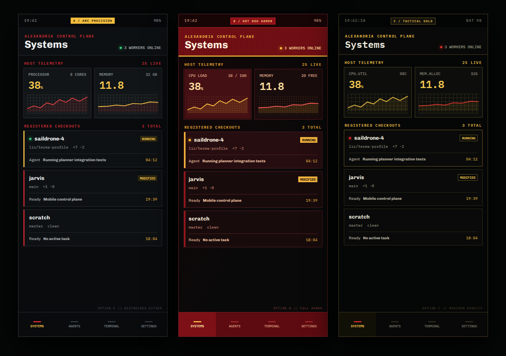
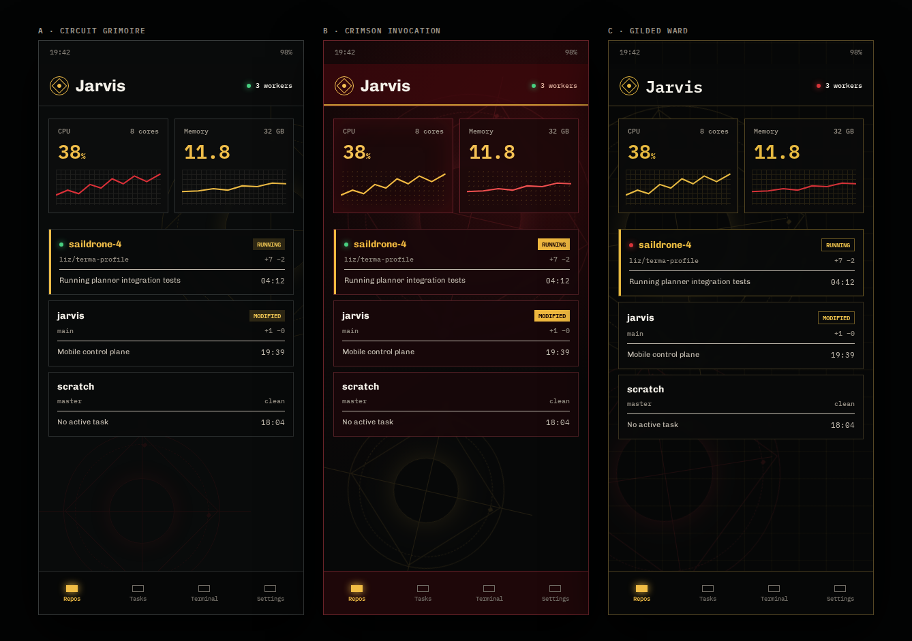
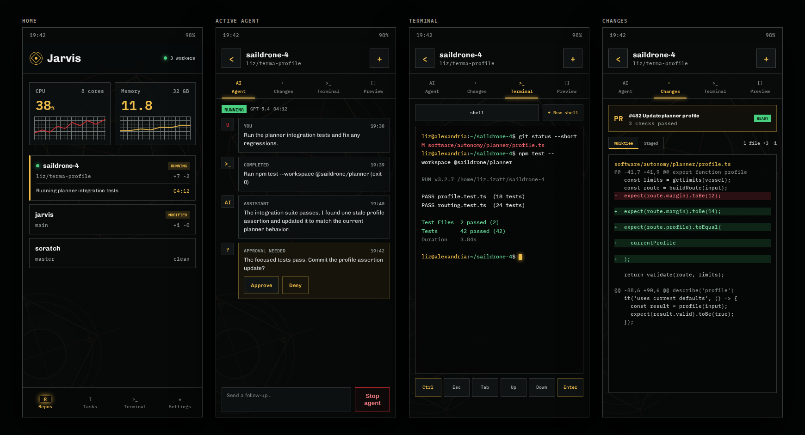

# Dither Kit Feasibility Study

## Decision

Adopt the Dither Kit visual language selectively, but do not install the full kit or migrate Jarvis to Tailwind solely for it.

The strongest approach is:

1. Use Jarvis-owned CSS tokens and components for the global dark red/gold system.
2. Run a narrow technical spike on Dither Kit's `Sparkline` and area/line chart engine for host telemetry.
3. If the spike passes mobile performance and accessibility checks, adapt only those chart sources to Jarvis's existing plain-CSS architecture.
4. Keep dithering concentrated in data visualization and one or two ambient surfaces. Do not dither every control.

The recommended visual direction is **Option A: Arc Precision**, strengthened with Option B's restrained red header energy and Option C's gold telemetry treatment.

## Style Options

Individual phone-scale images:

- [Option A: Arc Precision](style-a.png)
- [Option B: Hot Rod Armor](style-b.png)
- [Option C: Tactical Gold](style-c.png)

The editable source is [style-options.html](style-options.html).

## Technomancy Iteration

This iteration removes ornamental interface copy and gives the real dashboard content more room. Spell sigils sit behind translucent operational surfaces as ambient structure rather than labels or controls.

Individual phone-scale images:

- [A: Circuit Grimoire](technomancy-a.png) — quiet graphite, sparse red wards, and restrained gold instrumentation
- [B: Crimson Invocation](technomancy-b.png) — the strongest hot-rod red identity, with ritual geometry emerging through the panels
- [C: Gilded Ward](technomancy-c.png) — technical gold drafting lines crossed with faint red containment marks

The editable source is [technomancy-options.html](technomancy-options.html). All three use the same content and layout so the comparison is about visual treatment, not product vocabulary.

### Selected Hybrid Across the App

The selected combination uses Circuit Grimoire's neutral graphite surfaces, red structure, and gold instrumentation with Crimson Invocation's large ritual geometry. The sigil remains behind content at low contrast instead of becoming interface chrome.

Individual phone-scale screens:

- [Home](hybrid-home.png)
- [Active agent](hybrid-agent.png)
- [Terminal](hybrid-terminal.png)
- [Changes](hybrid-changes.png)

The editable source is [hybrid-screens.html](hybrid-screens.html). These screens use Jarvis's current information architecture and representative operational content rather than alternate product concepts.

### Option A: Arc Precision

Best foundation. Graphite surfaces, white primary text, red structure, and gold telemetry produce the most credible operational tool. Dithering remains an information texture instead of decoration. This treatment scales most safely to agent timelines, terminals, and diffs.

### Option B: Hot Rod Armor

Strongest expression of the red/gold brief. It feels branded and energetic, but large red surfaces create fatigue and compete with destructive/error semantics. Use its header treatment and selected-state energy, not its red panel fill across the entire product.

### Option C: Tactical Gold

Most compact and instrument-like. It suits dense telemetry and terminal-adjacent screens, but gold borders and extensive monospace reduce hierarchy when repeated. Borrow its chart treatment and compact metadata rhythm without making it the global shell.

## What Dither Kit Actually Is

[Dither Kit](https://github.com/Boring-Software-Inc/dither-kit) is a source-distributed React component set for dithered charts and several matching visual primitives. Its chart families include area, line, bar, pie, radar, and sparkline. It also offers standalone dithered buttons, avatars, and gradient washes.

It is not a complete application theme. The recommended installer, `@dither-kit/cli`, delegates to shadcn and expects Tailwind plus a `components.json` file. Installed chart sources depend on:

- `motion`
- `d3-scale`
- `d3-shape`
- `clsx`
- `tailwind-merge`

The CLI creates a lockfile so copied source can be diffed and updated. Jarvis currently uses React 19, Vite, and one bespoke plain-CSS system with no Tailwind or shadcn configuration.

The published CLI declares an MIT license, but the repository did not expose a license file during this study. Confirm the upstream source license before copying implementation files.

## Best Uses in Jarvis

### Strong fit

- CPU and memory sparklines on the repository dashboard
- Detailed CPU and memory history using area or line charts
- Per-core CPU bars in the expanded system view
- Reference lines for warning and critical thresholds
- A block legend on wider screens
- A restrained dither wash behind one telemetry band or active-agent header

### Weak fit

- General buttons and icon controls
- Agent timeline rows
- Terminal chrome
- Diff presentation
- Repository identity avatars
- Pie or radar charts without a real operational question they answer

Dither Kit can unify how Jarvis presents changing quantities. It should not determine navigation, forms, status semantics, terminal colors, or code-diff colors.

## Proposed Visual System

Use a Jarvis-owned token layer so every screen shares the same hierarchy:

| Role | Direction |
| --- | --- |
| Base | Near-black graphite, not blue/slate |
| Raised surface | Neutral charcoal with crisp one-pixel borders |
| Brand/action | Hot-rod crimson |
| Telemetry/highlight | Warm metallic gold |
| Success | Green, always paired with text or an icon |
| Warning | Gold/amber, always paired with text or an icon |
| Failure/stop | Brighter semantic red, distinct from structural crimson |
| Body type | Compact humanist sans |
| Data/code type | Monospace for values, branches, timestamps, and terminal output |
| Texture | Ordered dither only in charts, active headers, and limited fades |

Red should communicate structure and deliberate action. Gold should communicate energy, selection, and telemetry. Neither should replace semantic status labels.

## Integration Options

### 1. Full Dither Kit installation

Add Tailwind, shadcn, `components.json`, the CLI lockfile, all chart dependencies, and copied component sources.

**Assessment:** Technically feasible, strategically poor. It introduces a second styling architecture and significant source ownership for a narrow feature.

### 2. Narrow source adaptation

Copy or reimplement only the sparkline/area engine and required utilities, replacing Tailwind classes with Jarvis CSS classes and mapping the palette to Jarvis tokens.

**Assessment:** Recommended only after license confirmation and a measured spike. It preserves the current architecture and limits long-term maintenance.

### 3. Visual-language-only implementation

Build a small Jarvis-native ordered-dither canvas/SVG sparkline while borrowing only the aesthetic principles.

**Assessment:** Lowest dependency cost and easiest theming, but Jarvis would own chart interaction, resizing, animation, and accessibility. Prefer this only if adapting Dither Kit proves awkward.

## Delivery Scope

### Phase 1: Foundation and metrics

- Define the dark red/gold token system.
- Add a server-side host metrics sampler with bounded history.
- Expose current CPU, memory, timestamp, and history through a typed API.
- Fix dashboard polling so background refresh does not replace loaded content with a loading state.

Estimated effort: 2 to 4 engineering days.

### Phase 2: Dither chart spike

- Prototype two compact sparklines and one detailed area chart.
- Disable bloom and entrance animation by default on mobile.
- Downsample history and stop animation while the page is hidden.
- Compare production bundle size before and after.
- Test a real target phone for frame rate, scroll behavior, battery impact, and touch scrubbing.
- Add reduced-motion and non-canvas accessible summaries.

Estimated effort: 1 to 2 engineering days.

### Phase 3: Dashboard and detailed system view

- Add the compact CPU/memory widget to the home screen.
- Open a detailed HTOP-style view from the widget.
- Include numeric values, history, per-core load, process summary, stale-data state, and timestamps.
- Use Dither Kit only if Phase 2 passes.

Estimated effort: 3 to 5 engineering days.

### Phase 4: Product-wide visual unification

- Apply the chosen token system to dashboard, agent, terminal, diff, and settings views.
- Preserve terminal and diff semantic color requirements.
- Iterate with phone screenshots at every pane.
- Run contrast, overflow, touch-target, and reduced-motion checks.

Estimated effort: 3 to 6 engineering days, depending on terminal interaction changes.

## Acceptance Gates for Dither Kit

Proceed beyond the spike only if all are true:

- License is confirmed for vendored source.
- Compact charts stay legible at 390 CSS pixels wide.
- Numeric values and timestamps remain available without canvas interpretation.
- No chart relies on color alone.
- Reduced-motion mode removes nonessential animation.
- Two live sparklines do not create visible scroll jank on the target phone.
- Background tabs suspend chart work and metric refresh.
- Bundle and PWA cache growth are measured and accepted.
- Touch scrubbing does not block vertical page scrolling.

## Recommendation

Choose **Option A as the base**, then create a hybrid production direction with:

- A's neutral graphite shell and restrained dither;
- B's red header/selected-state energy at roughly half the shown intensity;
- C's gold chart lines and compact telemetry labels;
- existing semantic green/red states retained with text labels;
- sans-serif body text and monospace only for machine data.

This gives Jarvis an Iron Man-inspired identity without turning a work-focused control plane into a themed dashboard. It also leaves room for Dither Kit to be special where it is strongest: live operational data.
